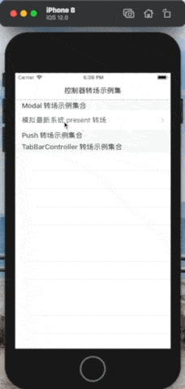
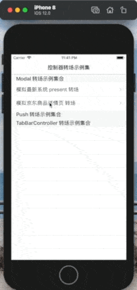

# VC-Transitions
iOS控制器转场示例，收集、整理、实现市面上App的控制器转场示例，帮助你实现转场业务需求时提供一点思路~

### 转场类别
* Modal转场

  | 模拟最新系统 present 转场                                    | 模拟 京东商品详情页 转场                                     |      |
  | ------------------------------------------------------------ | ------------------------------------------------------------ | ---- |
  |  |  |      |

  

* Push转场

* TabBarController切换转场

## 参考资料

### 文章

1. [WWDC 2013 Session笔记 - iOS7中的ViewController切换](https://onevcat.com/2013/10/vc-transition-in-ios7/)
2. [iOS 视图控制器转场详解](https://github.com/seedante/iOS-Note/wiki/ViewController-Transition)
3. 简书：关于自定义转场动画，我都告诉你
   1. [iOS自定义转场详解02——实现Keynote中的神奇移动效果](http://kittenyang.com/magicmove/)
   2. [iOS自定义转场详解04——实现3D翻转效果](http://kittenyang.com/3dfliptransition/)
   3. [iOS7 interactive transitions](http://dativestudios.com/blog/2013/09/29/interactive-transitions/)
4. [The Inconsistent Order of View Transition Events](http://wangling.me/2014/02/the-inconsistent-order-of-view-transition-events.html)
5. 一个丝滑的全屏滑动返回手势
   1. [轻松学习之二——iOS利用Runtime自定义控制器POP手势动画](https://www.jianshu.com/p/d39f7d22db6c)
6. 动效拆解工厂：Mask 动画
   1. [How To Make A UIViewController Transition Animation Like in the Ping App](https://www.raywenderlich.com/261-how-to-make-a-uiviewcontroller-transition-animation-like-in-the-ping-app)
   2. [放肆的使用UIBezierPath和CAShapeLayer画各种图形](https://www.jianshu.com/p/c5cbb5e05075)
7. Objccn
   1. [View Controller 转场](https://objccn.io/issue-5-3/)（文章里包含使用 GPUImage 定制动画。）
   2. [自定义 ViewController 容器转场](https://objccn.io/issue-12-3/)
   3. [交互式动画](https://objccn.io/issue-12-6/)
   4. [View Controller 容器](https://objccn.io/issue-1-4/)

### 官方文档

1. WWDC-Custom Transitions Using View Controllers: https://developer.apple.com/videos/play/wwdc2013/218/
2. WWDC-Advanced Techniques with UIKit Dynamics: https://developer.apple.com/videos/play/wwdc2013/221
3. WWDC-Advances in UIKit Animations and Transitions: https://developer.apple.com/videos/play/wwdc2016/216
4. View Controller Programming Guide for iOS: https://developer.apple.com/library/archive/featuredarticles/ViewControllerPGforiPhoneOS/index.html
5. UIViewPropertyAnimator: https://developer.apple.com/documentation/uikit/uiviewpropertyanimator
6. startInteractiveTransition(to:completion:): https://developer.apple.com/documentation/uikit/uicollectionview/1618098-startinteractivetransition
7. How to pause the animation of a layer tree: https://developer.apple.com/library/archive/qa/qa1673/_index.html

### 开源代码

1. https://github.com/onevcat/VCTransitionDemo
2. https://github.com/seedante/iOS-ViewController-Transition-Demo
3. https://github.com/seedante/ControlPanelAnimation
4. https://github.com/ColinEberhardt/VCTransitionsLibrary
5. https://github.com/forkingdog/FDFullscreenPopGesture
6. https://github.com/Yalantis/StarWars.iOS
7. https://github.com/leichunfeng/WXTabBarController
8. https://github.com/andreamazz/BubbleTransition
9. https://github.com/KittenYang/KYMagicMove
10. https://github.com/KittenYang/KYPushTransition
11. https://github.com/hayyyyyyden/ViewControllerTransitionsDemo/tree/master/issue5-demo1（Fixed）
12. https://github.com/objcio/issue-12-custom-container-transitions
13. https://github.com/RickiG/view-controller-containment

## 写在文末

欢迎提交PR，实现更多有趣的控制器转场示例~
